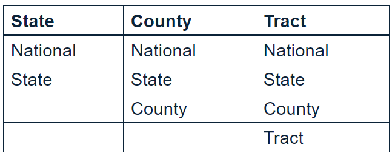
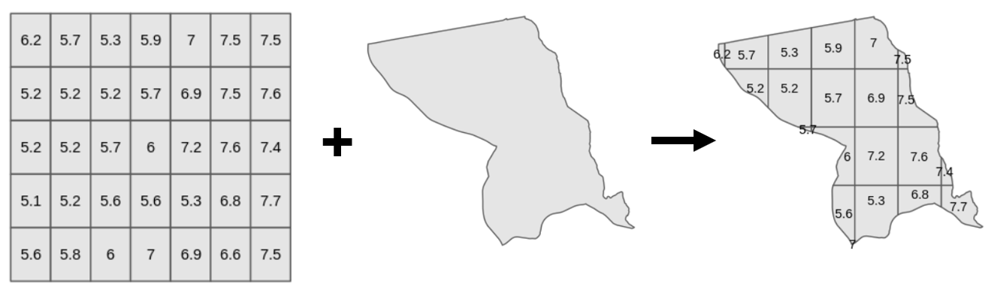
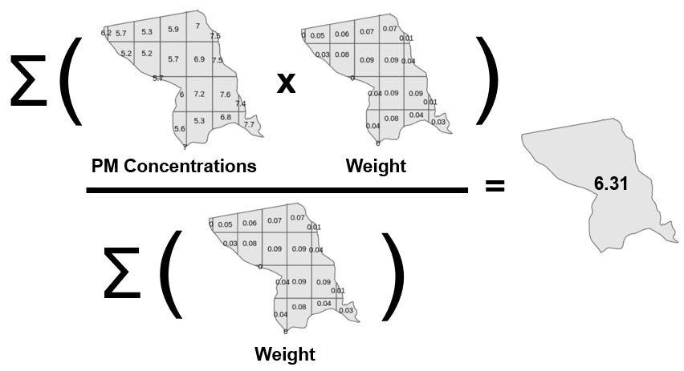

```{r, include = FALSE}
knitr::opts_chunk$set(
  collapse = TRUE,
  comment = "#>"
)
devtools::load_all()
library(ACAGPM)
```

## Introduction

Particulate Matter (PM2.5) is a term referring to microscopic particles, not greater than 2.5 micro-meters in diameter, suspended in air. These particles have a variety of adverse health effects on humans, given their ability to quickly enter the bloodstream via inhalation. Research initiatives, specifically with regards to climate and human health, can greatly benefit from access to PM2.5 data; this package provides users with easy access to said data.

## Available Data

This package combines *WUSTL's Atmospheric Composition Analysis Group* raster files with *tigris* shape file data at 3 different granularities for a variety of years. Those three granularities are as follows:

1. State
1. County
1. Census Tract

Years 2015 through 2018 are included within the package, while years 2014 and prior are available as a pull combining PM2.5 raster files and *tigris* shape files. Data is returned in csv format, including the fields GEOID, NAME, and Particulate.Matter. An additional field is included for state and county pulls, representing the states or counties chosen by the user, respectively. Each granularity can be pulled at the level of the granularity and above.



The PM2.5 levels are the mean area-weighted PM2.5 values for a select geography, calculated as follows.

### Step 1: Projection

In order to calculate particulate matter concentrations for a specific geography, the raster and shapefiles must first be combined via projection. Projection takes place as follows.

1. Pull the shape file for desired geography
1. Crop the raster file to the shape file of the geography
1. Project the raster file's values onto the shape file

An example of projection for Census Tract 123 of Providence County, Rhode Island is shown below.



### Step 2: Area-Weighted Mean

The particulate matter value assigned to a particular geography is calculated via area-weighted mean. Some things to note:

* PM Concentrations are the PM values found in a grid block
* Weight is the area of a grid block contained in the geography, divided by the total area of the geography
* Exact value is found by summing the PM Concentrations multiplied by the corresponding weights, then dividing that sum by the sum of all weights.

An example of a calculation for Census Tract 123 of Providence County, Rhode Island is shown below.



**Note: Alaska and Hawaii are not available.**

## How to Use

### State: pull_state_ACAG(pull_type, year = NULL, level, state = c(), acag = NULL)

Internally pulls national or state data for a given year, broken down by available states with PM2.5 concentrations. Requires the fields pull_type, year, level, and state depending on level.

```{r}
state_pm <- ACAGPM::pull_state_ACAG(pull_type = "Internal", 
                                    year = 2016, 
                                    level = "State", 
                                    state = c("22", "44", "45"))
head(state_pm)
```

### County: pull_county_ACAG(pull_type, year = NULL, level, state = c(), county_state = c(), acag = NULL)

Internally pulls national, state, or county data for a given year, broken down by counties with PM2.5 concentrations. Requires the fields pull_type, year, level, and state or county_state depending on level.

```{r}
county_pm <- ACAGPM::pull_county_ACAG(pull_type = "Internal", 
                                      year = 2016, 
                                      level = "County", 
                                      county_state = c("45001", "22001", "44001"))
head(county_pm)
```

### Census Tract: pull_tract_ACAG(pull_type, year = NULL, level, state = c(), county_state = c(), tract_county_state = c(), acag = NULL)

Internally pulls national, state, county, or tract data for a given year, broken down by census tracts with PM2.5 concentrations. Requires the fields pull_type, year, level, and state, county_state, or tract_county_state depending on level.

```{r}
tract_pm <- ACAGPM::pull_tract_ACAG(pull_type = "Internal", 
                                    year = 2016, 
                                    level = "Tract", 
                                    tract_county_state = c("45001950200", "45001950300", "45001950600"))
head(tract_pm)
```


### Additional: lookup_GEOID(state = NULL, county = NULL, tract = NULL)

Pulls the GEOID corresponding to the name of a geography.

```{r}
state_id <- ACAGPM::lookup_GEOID(tract = "9502, Abbeville, South Carolina")
print(state_id)
```

## Use Case: Association Between PM2.5 and Population Density in RI

Let's suppose we wish to investigate the association between Particulate Matter levels and another variable. In particular, let's see if population density may have a correlation with particulate matter levels at the census tract granularity.

```{r, message = FALSE, results = 'hide'}
library(tidycensus)
library(ggplot2)
library(tigris)
library(gridExtra)

census_api_key("ff942edcde192676c9bf58546ca77f7e97b58a46")

this_state <- "RI"
this_county <- "Providence"

county_geoid <- lookup_GEOID(county = "Providence, RI")

acs_populations_2016 <- tidycensus::get_acs(geography = "tract", variables = "B01003_001", year = 2016, state = "RI", county = "Providence", geometry = TRUE)

acs_populations_2016 <- acs_populations_2016 %>%
  dplyr::mutate(pop_per_sq_km = estimate / as.numeric(sf::st_area(geometry)) * 1000000) %>%
  dplyr::select(GEOID, pop_per_sq_km)

pm_2016 <- pull_tract_ACAG(pull_type = "Internal", year = 2016, level = "County", county_state = county_geoid)

pm_2016 <- pm_2016 %>%
  dplyr::select(GEOID, Particulate.Matter)

acs_pm_data <- acs_populations_2016 %>%
  dplyr::left_join(pm_2016, by = "GEOID")
```

Plotting the variables on a map might help us visualize the situation here.

```{r}
density_plot <- ggplot(acs_pm_data) + 
                  geom_sf(mapping = aes(fill = pop_per_sq_km)) + 
                  scale_fill_gradient(low = "#adcbff", high = "#04183b") +
                  theme(axis.text.x = element_blank(),
                        axis.text.y = element_blank(),
                        axis.ticks = element_blank(),
                        rect = element_blank())

pm_plot <- ggplot(acs_pm_data) + 
                  geom_sf(mapping = aes(fill = Particulate.Matter)) + 
                  scale_fill_gradient(low = "#adcbff", high = "#04183b") +
                  theme(axis.text.x = element_blank(),
                        axis.text.y = element_blank(),
                        axis.ticks = element_blank(),
                        rect = element_blank())

grid.arrange(density_plot, pm_plot, nrow = 2)

```

There appears to be a bit of a correlation just by looking at these plots alone. Let's go further.

We can visualize the relationship between these variables via a scatterplot with a regression line.

```{r}
ggplot(acs_pm_data, aes(x = pop_per_sq_km, y = Particulate.Matter)) +
  geom_point() + 
  geom_smooth(method = lm)
```

There does at least appear to be a logarithmic relationship of sorts between the 2 variables. Let's see if a linear relationship stands.

```{r}
acs_pm_model = lm(formula = Particulate.Matter~pop_per_sq_km, data = acs_pm_data)
summary(acs_pm_model)
```

We can observe that the population density variable has a t-value of 11.01, making it statistically significant in this model. Thus, we can conclude that there is a significant relationship between population density and particulate matter values for Providence County, RI.

## External Data

In order to pull PM2.5 data for years 2000-2014, additional steps must be taken, detailed in this section. 

### Step 1: Retrieving Raster Files

Go to the [Surface PM2.5 Data Folder](https://wustl.app.box.com/v/ACAG-V4NA03-PM25/folder/136303334735) owned by Washington University in St. Louis' Atmospheric Composition and Analysis Group. Files will be in the format

<center> *V4NA03_PM25_NA_**YEAR**01_**YEAR**12-RH35-NoNegs.asc.zip* </center>

where **YEAR** is the desired year of data. Save the file to a directory of your choosing. Then, use your favorite file compression tool to unzip the file. 

There will be 2 files: *V4NA03_PM25_NA_**YEAR**01_**YEAR**12-RH35-NoNegs.asc* and *V4NA03_PM25_NA_**YEAR**01_**YEAR**12-RH35-NoNegs.prj*. The *.asc* file will be of use to us in this case.

### Step 2: Load Raster Object in R

Execute the following R code. This will load the raster file into R as a RasterLayer object. Make sure that file_dir is the directory which contains the PM2.5 raster file, and year matches the **YEAR** value in the filename.

```{r, eval = FALSE}
library(raster)

file_dir <- "C:/Users/userName/Desktop/ACAGPM"
year <- 2000

acag <- raster::raster(
  file.path(
    file_dir, 
    paste0("V4NA03_PM25_NA_", year, "01_", year, "12-RH35-NoNegs.asc")
  ))

acag@data@names <- "Value"

```

### Step 3: Call Desired Function

Call whichever of the ACAGPM functions you would like.

#### State: pull_state_ACAG(pull_type, year = NULL, level, state = c(), acag = NULL)

Externally pulls national or state data for a given year, broken down by available states with PM2.5 concentrations. Requires the fields pull_type, level, acag, and state depending on level.

```{r, eval = FALSE}
state_pm <- ACAGPM::pull_state_ACAG(pull_type = "External", 
                                    level = "State", 
                                    acag = acag, 
                                    state = c("22", "44", "45"))
head(state_pm)
```

#### County: pull_county_ACAG(pull_type, year = NULL, level, state = c(), county_state = c(), acag = NULL)

Externally pulls national, state, or county data for a given year, broken down by counties with PM2.5 concentrations. Requires the fields pull_type, level, acag, and state or county_state depending on level.

```{r, eval = FALSE}
county_pm <- ACAGPM::pull_county_ACAG(pull_type = "External", 
                                      level = "County", 
                                      acag = acag, 
                                      county_state = c("45001", "22001", "44001"))
head(county_pm)
```

#### Census Tract: pull_tract_ACAG(pull_type, year = NULL, level, state = c(), county_state = c(), tract_county_state = c(), acag = NULL)

Externally pulls national, state, county, or tract data for a given year, broken down by census tracts with PM2.5 concentrations. Requires the fields pull_type, level, acag, and state, county_state, or tract_county_state depending on level.

```{r, eval = FALSE}
tract_pm <- ACAGPM::pull_tract_ACAG(pull_type = "External", 
                                    level = "Tract", 
                                    acag = acag, 
                                    tract_county_state = c("45001950200", "45001950300", "45001950600"))
head(tract_pm)
```
